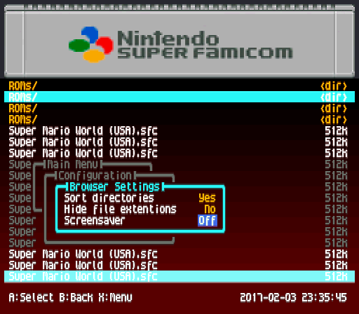
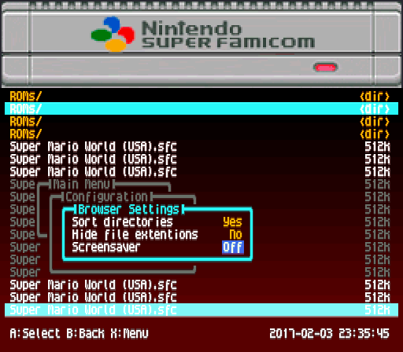
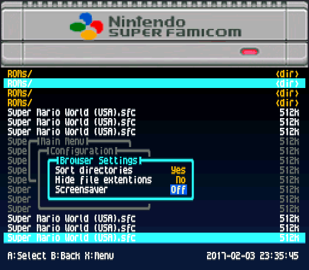
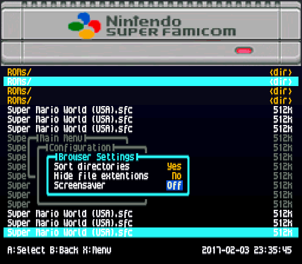

# SFC Classic Mini Theme Pack  
by MurasamePrime

## Overview
This theme pack brings the look and feel of the Super Famicom / SNES Classic Mini to your FXPak Pro (SD2SNES) menu.  
It includes multiple variations so you can choose between a clean minimal style or a more detailed console front panel look.

## Variants
- **Plain** – minimalist version without console details, focused on readability.  
- **Detail Dark** – elegant dark theme, ideal for a night mode look.  
- **Detail Blue** – vibrant blue accent theme, inspired by the SNES Classic Mini UI.  
- **Detail Maroon** – warm red accent theme, with retro arcade vibes.  

## Included Files
Each theme folder contains:  
- `menu.bin` – theme file for older SD2SNES firmware  
- `m3nu.bin` – theme file for FXPak Pro and newer SD2SNES firmware  
- `preview.png` – screenshot preview of the theme  

## Installationenglish
1. Backup your current `menu.bin` from the root of your SD card.  
2. Copy the new `menu.bin` (or `m3nu.bin`, depending on your firmware) from the theme folder into the SD card root.  
3. Start your FXPak Pro and the new theme will load.  

**Important:** Only keep one of the files (`menu.bin` or `m3nu.bin`) on the SD card at a time. Having both will cause conflicts.  

## Preview

- Plain  
  

- Detail Maroon  
  
  
- Detail Blue  
  

- Detail Dark  
  

